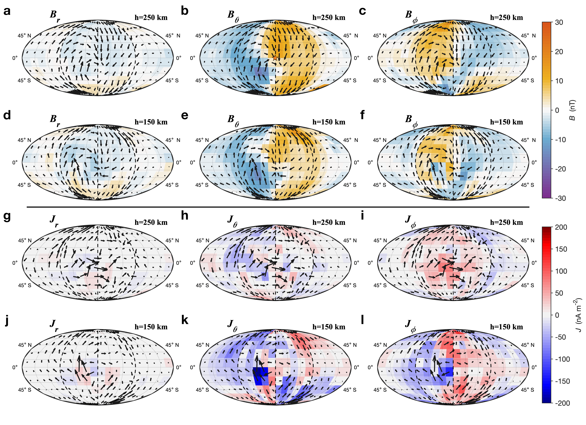
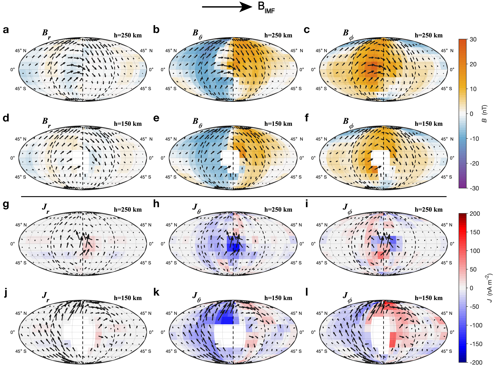

# Mars_iono_current
---
##
#This paper is published in Nature communications (https://doi.org/10.1038/s41467-024-54073-9)

---

#Code for "Characterizing the current systems in the Martian ionosphere"

The magnetic fields and current distribution in the Martian magnetosphere and ionosphere observed by MAVEN.

The code to calculating the current and electric field are available at Figure 1, Figure 2, Figure 4, 
For calculating the conductivity, see jisuan_mars_150km_MSO.m
## 
---
If you want to repeat the following figures, run Matlab Script in /Figure/. 

 # Coordinates
  
See the paper for more details.

  # Requirements
  
  This code is compatible with Windows and Mac operating systems, with Matlab installed. 
  
  # Results
  
  Just run the Figure.m in Matlab, and you will get the output fig. Note that large files are not uploaded (It is big.. MAVEN_4s_q_2023.mat is about 10.04 GB), please load the .mat in data and plot the figure.

  If you have any questions about those scripts, or you are interested in the large files, e.g., MAVEN_4s_q_2023.mat, please contact gaojw@mail.iggcas.ac.cn.

  
  # License
  This code is covered under the MIT License.
